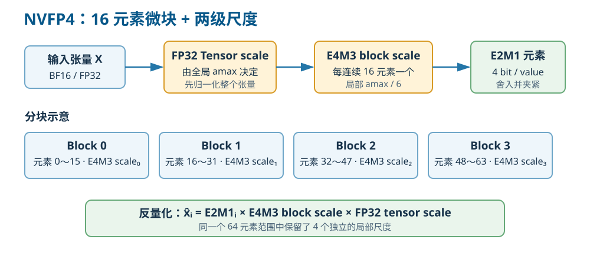
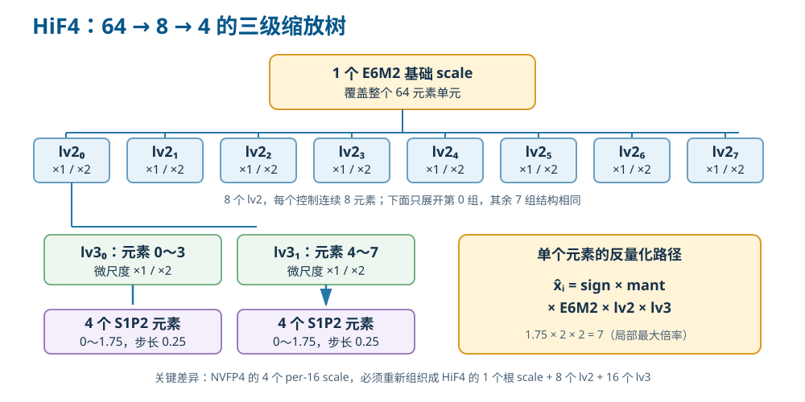

# NVFP4 → HiF4 项目调研与方案总结

> 项目：2026 华为算法大赛初赛 - 高精度 4Bit 数值转换算法  
> 更新时间：2026-08-31

## 1. 项目目标

本项目需要将 NVIDIA NVFP4 数据转换成昇腾 HiF4 参数，并尽量保持大模型 Linear 和 Attention 的计算结果不变。

```text
NVFP4 Weight / Activation / Q / K / V
                    ↓ 固定反量化
                 BF16 参考值
                    ↓ 参赛算法
              合法 HiF4 参数
                    ↓
        Linear / Attention 输出误差评测
```

比赛参考值是给定 NVFP4 数据反量化后的结果，不是模型最初的 BF16/FP32 数据。因此，本质上是一次受 HiF4 格式约束的二次量化。

单个用例得分为：

$$
Score=(MSE_{STD}-MSE_{PLAYER})/MSE_{STD}
$$

参赛算法误差低于标准 HiF4 算法时得正分，高于标准算法时得负分。

## 2. 为什么需要这种转换

FP4 可以降低大模型的权重、Activation 和 KV Cache 存储及搬运开销。但不同硬件平台采用的 FP4 格式并不一致：

| 特征 | NVFP4 | HiF4 |
|---|---|---|
| 元素格式 | E2M1 | S1P2 |
| block 大小 | 16 | 64 |
| 局部 scale | E4M3 | 两层 `{1,2}` 微尺度 |
| 基础 scale | FP32 per-tensor | E6M2 per-64 |
| 非负元素值 | 0、0.5、1、1.5、2、3、4、6 | 0～1.75，步长 0.25 |

NVFP4 的四个 16 元素 block 合并成一个 HiF4 64 元素 block 后，原有 scale 无法直接复制。算法必须重新选择 E6M2、两级微尺度和 mant。

该项目面向的实际价值是：减少模型跨硬件平台部署时重新训练或重新量化的成本，并提升既有 NVFP4 模型资产在 HiF4 平台上的兼容性。

## 3. 赛题任务

### 3.1 Linear

输入：

- NVFP4 Weight；
- Calibration Activation；
- 在线 Test Activation。

目标：

$$
\min MSE(X_{HiF4}W_{HiF4}^{T},
X_{NVFP4}W_{NVFP4}^{T})
$$

校准函数负责量化 Weight 并生成 `activation_state`；动态函数使用 state 量化当前 Activation。

### 3.2 Attention

输入：

- Calibration Q/K/V；
- Test Q/K/V；
- Q head、KV head 和 head dimension。

目标：

$$
\min MSE(Attention(Q_{HiF4},K_{HiF4},V_{HiF4}),
Attention(Q_{NVFP4},K_{NVFP4},V_{NVFP4}))
$$

校准函数生成 `q_state`、`k_state` 和 `v_state`，在线阶段分别量化 Q、K、V。

### 3.3 关键约束

- 必须实现任务书规定的六个接口；
- HiF4 参数必须严格合法；
- state 只能包含基础类型、CPU Tensor、list/tuple 和字符串键 dict；
- 单次提交总运行时间不超过五分钟；
- 禁止计算 `A @ W` 后利用结果反向拟合 `Q(A)`；
- `self_check.py` 只检查格式，不代表精度得分。

## 4. 固定的数值规则

### 4.1 NVFP4 反量化

比赛已经确定 NVFP4 反量化方法：

```python
x = quant_float.unflatten(-1, (-1, 16))
x = x * scale_float.unsqueeze(-1)
x = x.flatten(-2, -1).to(torch.bfloat16)
```

算法不需要解析原始 4-bit bitstream，也不能改变判题器对 NVFP4 的解释。



图中以连续 64 个元素为例：NVFP4 实际保留 4 个独立的 per-16 E4M3 局部尺度，并与全 Tensor 的 FP32 scale 共同完成反量化。

### 4.2 HiF4 反量化

HiF4 每 64 个元素包含：

- 1 个 E6M2 `scale_factor`；
- 8 个 `scale_lv2`，每个控制 8 个元素；
- 16 个 `scale_lv3`，每个控制 4 个元素；
- 64 个 `sign/mant`。

固定反量化公式：

$$
\hat{x}=sign\times mant\times scale_{lv3}
\times scale_{lv2}\times scale_{factor}
$$

合法范围：

```text
scale_factor：E6M2
scale_lv2   ：1 或 2
scale_lv3   ：1 或 2
sign        ：-1、0 或 1
mant        ：0～1.75，步长 0.25
```

反量化规则是确定的；比赛需要优化的是如何选择这些参数。



HiF4 用一个 E6M2 根尺度覆盖 64 个元素，再用 8 个 lv2 和 16 个 lv3 恢复局部动态范围。NVFP4 的四个局部尺度无法直接复制，因此转换时必须重新选择整棵缩放树。

## 5. 当前 baseline 的方案

当前 `baseline.py` 使用“格式内搜索 + 校准二阶补偿”的两层结构。

### 5.1 第一层：HiF4 格式内搜索

`_encode()` 的流程是：

1. 将四个 NVFP4 block 合并为 64 元素；
2. 从 `max_abs/7` 附近选取多个 E6M2 候选；
3. 在 HiF4 树状约束下选择 lv2/lv3；
4. 将每个元素舍入到 S1P2；
5. 对给定离散参数重新拟合连续最优 scale；
6. 将 scale 舍入到最近合法 E6M2；
7. 选择重构 MSE 最小的候选。

这比官方单纯由局部最大值决定 scale 的方式更强，但目前搜索范围较窄，scale 回归后也没有再次更新 mant。

### 5.2 第二层：SVD 二阶统计

Linear 中，设权重量化误差为：

$$
D=W-\hat W
$$

校准输入为 $A$，最终输出误差为：

$$
\|AD^T\|_F^2=\sum_r d_r^T(A^TA)d_r
$$

因此不同通道的误差重要性由 $A^TA$ 决定。baseline 使用截断 SVD 近似该矩阵：

$$
A\approx U_k\Sigma_kV_k^T
$$

$$
A^TA\approx V_k\Sigma_k^2V_k^T
$$

这样可以用 `[rank, hidden_size]` 的低秩 state 表示重要方向，避免保存完整 Hessian。

### 5.3 Schwarz 分组舍入

普通最近邻对每个元素独立选择 floor 或 ceil。当前方案每次联合枚举一组元素的上下舍入组合，并根据全局投影误差更新后续决策。

它允许以下现象：某个元素不选择离自身最近的值，但它产生的误差与其他通道误差抵消，最终矩阵乘误差反而更小。

这与 GPTQ 的二阶误差补偿思想一致。

## 6. 参考提交与版本路线分析

### 6.1 版本定位

根据现有成绩记录，几个关键版本的定位如下：

| 版本 | 平台 V2 得分 | 核心路线 | 版本定位 |
|---|---:|---|---|
| V42 | 24839 | Attention Q/K 公共谱基底与互逆变换 | 当前最高分综合版本，作为最终方案上界 |
| V37 | 24438 | V42 的简化父版本 | 结构更简单、运行更稳定 |
| V32 | - | Linear Hessian/GPTQ | 独立研究权重量化误差补偿 |
| V33 | - | Attention K 全协方差选择 | 补充研究，平台耗时接近 300 秒 |

这四个版本不是简单的连续增强关系，而是三条研究路线：

```text
Attention 主线：V37（稳定基线） -> V42（公共谱基底）
Linear 支线：  V32（Hessian/GPTQ）
Attention 支线：V33（K 全协方差，精度/耗时探索）
```

V42 比 V37 高 401 分，约提升 1.64%。两者的差异表明公共谱基底带来了可见收益，同时 V37 仍具有结构简单、运行稳定的特点。

### 6.2 V42：Q/K 公共谱基底与互逆变换

Attention logits 由 $QK^T$ 决定。对任意可逆矩阵 $R$，存在恒等关系：

$$
(QR)(KR^{-T})^T=QK^T
$$

因此可以在不改变浮点 logits 的前提下，把 Q 和 K 变换到同一个公共基底：

```text
Q' = Q R
K' = K R^{-T}
```

若 $R$ 来自 Q/K 联合统计的特征向量或谱分解，就可以把主要能量方向集中、解耦或重新排序，使 HiF4 的 64 元素分块和共享 scale 更容易表示。其真正目标不是让 Q、K 各自的 Tensor MSE 最小，而是让二者的乘积误差更小。

该方法有效的关键是“公共”和“互逆”：Q/K 必须共享同一坐标系，并使用严格配对的 $R$ 与 $R^{-T}$。若两侧独立选基底，或者只旋转一侧，浮点乘积本身就会改变。

其局限主要来自谱基底的数值稳定性、$R$ 的条件数、GQA 的多头统计聚合以及在线变换成本。浮点恒等也不代表量化后必然更优，平台得分才是该变换实际效果的最终体现。

### 6.3 V37：稳定的 Attention 父版本

V37 是 V42 的父版本，得分只低 401，但结构更简单、运行更稳定。它保留了 Attention 路线的主体，同时没有 V42 公共谱基底带来的额外复杂度，因此能够清楚反映谱基底模块对得分和稳定性的影响。

### 6.4 V32：Linear Hessian/GPTQ 独立路线

Linear 输出误差满足：

$$
\|A(W-\hat W)^T\|_F^2
=\sum_r d_r^T(A^TA)d_r
$$

V32 的 Hessian/GPTQ 路线直接围绕 $H=A^TA$ 优化权重量化误差：当前列量化后，把该列残差按逆 Hessian 传播到尚未量化的列，从而允许不同通道的误差相互补偿。

这条路线与 Attention 公共谱基底基本正交，反映的是 Linear 权重量化中的二阶误差补偿能力。

### 6.5 V33：Attention K 全协方差路线

K 的量化误差通过 $Q\Delta K^T$ 进入 logits，因此用对应 Q 的协方差作为 K 的二阶代理是合理的。V33 使用更完整的协方差，可以描述通道间相关性，比单纯逐通道重要性更接近最终 logits 目标。

但平台耗时接近 300 秒，已经逼近总时限。这说明全协方差虽然表达能力更强，但矩阵构造、分解、逆矩阵保存和逐块修复带来了明显的工程成本。

### 6.6 当前 `solution/v0_hessian_repair/solution.py` 的可验证实现

当前参考实现已整理为 `solution/v0_hessian_repair/solution.py`。项目中没有 V37/V32/V33 的独立源码。该文件实现了完整六接口闭环。

在 Linear 部分，它先进行通用 HiF4 参数搜索，再根据 Activation 二阶矩构造 2 的整数幂互逆预条件，使变换后的 Weight 与在线 Activation 仍保持原矩阵乘关系。随后代码构造 64 维 block Hessian，比较自然序、逆序和 Hessian 对角降序，并继续进行 128 维相邻 block、尾部样本 Pareto 门控和 Top-4 联合修复。

在 Attention 部分，它按照 Q/K 最大值构造互逆平滑缩放，使 Q 除以 scale、K 乘以 scale 后仍保持内积不变。Q 的 Hessian 来自 K 的协方差，K 的 Hessian来自同组全部 Q head 的协方差。V 只使用二阶能量和少量最大值信息构造逐通道重要性。各模块在 shape、有限值、Cholesky 或 state 校验失败时都会退回普通合法 HiF4 量化。

需要特别注意版本标识：该文件明确设置 `rotation_group_size=0`，并记录 `stable-v3-basis-no-rotation`。因此它**没有实现 V42 描述中的公共谱旋转**。在获得各版本原始文件前，不能把当前 `solution.py` 直接认定为 V42；它更像“Linear 强化 + Attention 平滑/Hessian”的另一套综合实现。

## 7. 外部分享观点与现有实现理解

本节汇总 Softmax、GPTQ 以及当前参考提交中值得关注的内容。这些观点用于解释方案为什么可能有效，不作为后续方案设计。

### 7.1 Softmax 对 Q/K 误差的影响

对任意常数 $c$，Softmax 满足行平移不变性：

$$
softmax(z+c\mathbf{1})=softmax(z)
$$

因此，Q/K 量化引起的 logits 误差中，每一行的常数偏移不会改变 Softmax 输出。直接使用 logits MSE 会把这种无害偏移也计入误差，而行中心化 logits MSE 更接近 Softmax 真正敏感的方向。不过，量化误差通常不能自由转化为行常数，因此该性质主要用于理解误差，而不能单独证明某种量化方法一定有效。

### 7.2 Softmax 对 V 误差的影响

设 $P=softmax(L)$，则每行权重之和恒为 1，即：

$$
P\mathbf{1}=\mathbf{1}
$$

Attention 输出为 $O=PV$。V 的量化误差经过 $P$ 加权后传递到输出，因此高 Attention 权重访问的 token 更重要，普通 V Tensor MSE 不能完全代表最终 Attention MSE。同时，如果所有 V token 都带有相同偏移，该偏移会完整保留，而不会被 Softmax 抵消。

### 7.3 对“GPTQ 做两倍”的理解

“GPTQ 做两倍”缺少上下文，可能表示执行两遍 GPTQ、扩大 block 或搜索预算，也可能表示放大补偿项。前两种解释属于计算预算增加，最后一种则会改变逆 Hessian 推导出的补偿关系，存在过补偿和数值不稳定风险。

当前 baseline 的“先格式搜索，再进行 Schwarz 多轮更新”和参考提交中的多顺序 Hessian 修复，都具有重复检查、传播和接受更优量化结果的特点，与“两遍优化”在概念上接近。但仅凭这句话无法确认分享者的原意，因此报告只保留其可能含义，不把它视为已经确定的算法步骤。

### 7.4 当前实现的整体认识

当前参考提交将多种思路组合在一起：HiF4 合法参数搜索负责控制基础重构误差；Linear 使用互逆预条件和 Hessian/GPTQ 修复，使权重与 Activation 的量化误差能够按输出敏感度补偿；Attention 使用 Q/K 互逆平滑和对侧协方差，让 Q 的误差由 K 的统计衡量、K 的误差由 Q 的统计衡量；V 则采用较保守的逐通道能量权重。

这些方法的共同点是：不再只追求单个 Tensor 的重构 MSE，而是利用 Linear 或 Attention 的计算结构衡量哪些误差真正影响最终输出。与此同时，当前参考文件没有实现 V42 所描述的公共谱旋转，因此版本说明与现有代码仍需分开理解。

## 8. 资料

1. [比赛中文任务书](../reference/2026年华为算法大赛-初赛任务书-0819-V2.docx)
2. [HiFloat4 Format for Language Model Inference](https://arxiv.org/abs/2602.11287)
3. [HiFloat4 官方说明](https://hifloat.gccorg.com/docs/en/hifloat4/white_paper/hifloat4_format_for_language_model_inference.html)
4. [NVIDIA NVFP4 官方文档](https://docs.nvidia.com/deeplearning/transformer-engine/user-guide/features/low_precision_training/nvfp4/nvfp4.html)
5. [Pretraining Large Language Models with NVFP4](https://arxiv.org/abs/2509.25149)
6. [GPTQ](https://arxiv.org/abs/2210.17323)
7. [SmoothQuant](https://arxiv.org/abs/2211.10438)
8. [AWQ](https://arxiv.org/abs/2306.00978)
9. [QuaRot](https://arxiv.org/abs/2404.00456)
10. [SpinQuant](https://arxiv.org/abs/2405.16406)
11. [KIVI](https://arxiv.org/abs/2402.02750)
